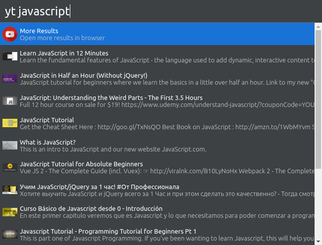

# Cerebro YouTube

> A Cerebro Plugin for searching YouTube

## Usage

In Cerebro, type `YT QUERY`. A List of videos and channels will appear. You can click on any to open in browser or you can use `Ctrl+C` to copy link to clipboard.

## Related

* [Cerebro](http://github.com/KELiON/cerebro) – main repo for Cerebro app;
* [cerebro tools](http://github.com/KELiON/cerebro-tools) – package with tools to simplify package creation;

## License

MIT © [Full License here](https://github.com/TheRealImaginary/se-miniproject/blob/master/LICENSE)
